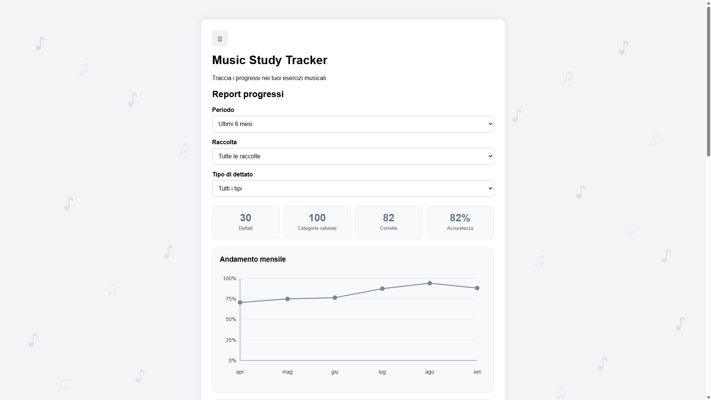
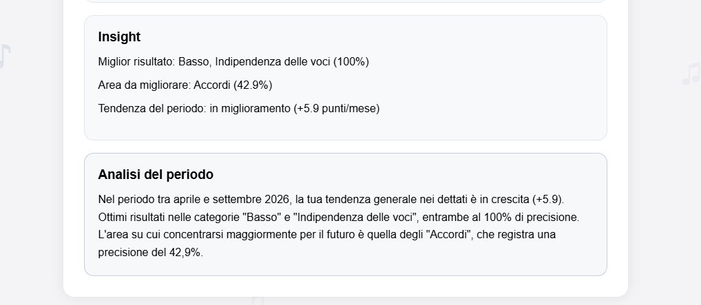
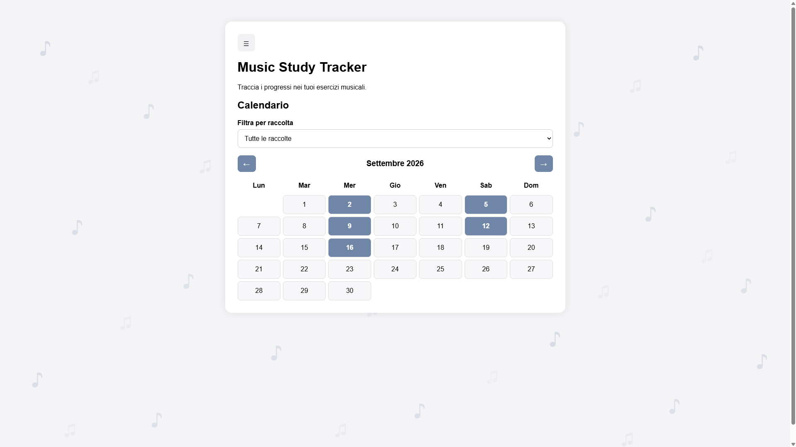
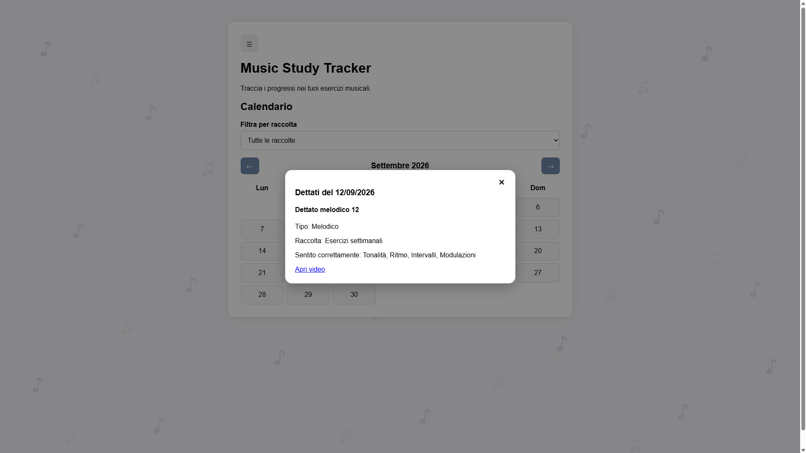
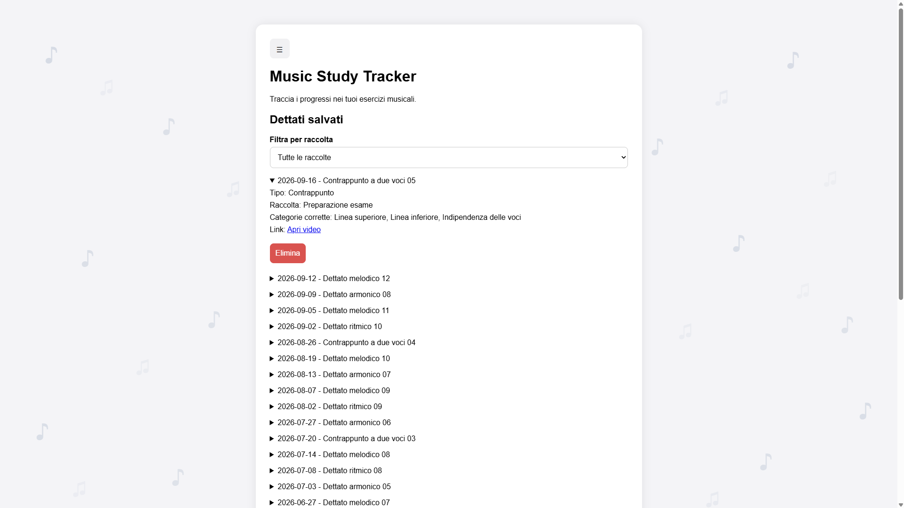

# Music Study Tracker

Music Study Tracker is a responsive full-stack web application built for a real music student around her specific study workflow.

The application allows users to record music dictation practice sessions, organize exercises by type and collection, evaluate musical categories, review previous work through an interactive calendar, and analyze progress through a dedicated Practice Report with statistical and AI-assisted insights.

## Live App

[Open Music Study Tracker](https://music-study-tracker.netlify.app)

## Screenshots

The screenshots below use demo data created specifically to demonstrate the application's functionality.

### Practice Report

The Practice Report summarizes the complete filtered dataset and shows overall accuracy together with the user's performance trend.



### Deterministic Insights and AI Analysis

Statistical insights are calculated by the application first. Google Gemini then receives those already-calculated conclusions and generates a short natural-language summary.



### Interactive Calendar

Practice days are highlighted directly in the monthly calendar.



Clicking a highlighted day opens the sessions completed on that date.



### Saved Dictations

Saved sessions can be reviewed individually together with their type, collection, correctly identified categories, and source link.



## Features

### Practice Sessions

- Sign up, sign in, and sign out
- Save the date, title, and YouTube link of each dictation session
- Assign sessions to a dictation type
- Create and use custom dictation types
- Create optional custom collections, such as study books or exercise groups
- Add and remove custom musical categories
- Select which categories were evaluated during each exercise
- Mark correctly identified categories
- View saved dictation sessions
- Sort saved sessions by date
- Filter saved sessions by collection
- Expand individual sessions to view their details
- Delete saved sessions
- Synchronize data across browsers and devices

### Custom Dictation Types

The application includes the default rhythmic, melodic, and harmonic dictation types while also allowing users to create their own.

Categories are associated with a specific dictation type, allowing the system to support study workflows beyond the original predefined categories.

Custom dictation types that have never been used can be permanently deleted.

If a dictation type is already referenced by saved dictations or categories, removing it archives the type instead of deleting the underlying database record.

Archived types:

- are hidden from the list of available types
- cannot be selected for new dictations
- cannot be used when creating new categories
- remain associated with previously saved data
- preserve the original type name when historical dictations are displayed

Creating a new type with the same name as an archived type reactivates the existing database record instead of creating a duplicate.

This preserves historical relationships while still allowing users to remove unused options from their current study workflow.

### Interactive Calendar

- Browse practice sessions through a monthly calendar
- Navigate between previous and following months
- Filter the calendar by collection
- Highlight days containing saved dictation sessions
- Click highlighted days to view all sessions completed on that date
- View session details inside a modal window
- Open the source video directly from the session details

### Practice Report

The Practice Report provides a backend-generated overview of the user's progress.

Users can filter the report by:

- current month
- previous month
- last 3 months
- last 6 months
- complete history
- custom date range
- collection
- dictation type

The report includes:

- total number of dictations
- total evaluated categories
- total correct categories
- overall accuracy
- results grouped by dictation type
- results grouped by musical category
- best-performing category or categories
- category or categories requiring the most improvement
- performance trend over time

Statistics are calculated from the complete filtered dataset on the backend rather than from only the data currently rendered by the frontend.

### Adaptive Trend Visualization

The report automatically chooses the appropriate time resolution for the selected period.

It displays:

- daily results for the current month
- daily results for the previous month
- daily results for custom periods up to 45 days
- monthly results for longer custom periods
- monthly results for 3-month, 6-month, and complete-history reports

The chart is based on category accuracy rather than simply counting completed sessions.

This makes it possible to visualize how accurately the student is performing over time rather than only how frequently they practise.

### Deterministic Practice Insights

The application calculates its main conclusions before any AI request is made.

The deterministic insight layer identifies:

- the strongest-performing category or categories
- the category or categories that need the most improvement
- the overall performance trend

These calculations remain the source of truth for the report.

### AI-Assisted Analysis

The application integrates Google Gemini to transform the already-calculated report insights into a short natural-language analysis.

Gemini receives only:

- the selected report period
- the global summary
- the deterministic insights

The model is explicitly instructed not to recalculate statistics, choose different categories, invent values, or replace the conclusions produced by the application.

This keeps statistical logic inside the application while using AI only for presentation and interpretation.

### Non-Blocking AI Loading

The statistical report and the AI analysis use separate API requests.

The main report endpoint returns the calculated statistics immediately:

```text
GET /statistics/report
```

Once the report has been rendered, the frontend independently requests the AI commentary:

```text
POST /statistics/report/ai
```

As a result, external AI latency does not block the main Practice Report.

If Gemini takes longer to respond, the user can still immediately see:

- summary statistics
- trend graph
- results by dictation type
- results by category
- deterministic insights

The AI section is updated separately when its response becomes available.

## Technologies

### Frontend

- HTML
- CSS
- JavaScript
- Clerk authentication
- Jest
- jsdom
- Netlify

### Backend

- Node.js
- Express
- REST API
- Clerk server-side authentication
- Google Gemini API
- express-rate-limit
- CORS
- Jest
- Supertest
- Vercel

### Database

- PostgreSQL
- Neon
- PostgreSQL Row Level Security
- `pg`

### Development and Infrastructure

- Git
- GitHub
- GitHub Actions
- Playwright
- Docker
- Visual Studio Code

## Architecture

The frontend is deployed on Netlify and communicates with a Node.js and Express backend deployed on Vercel.

PostgreSQL data is hosted on Neon.

Authentication is handled through Clerk.

```text
Frontend on Netlify
        ↓
Clerk session token
        ↓
Node.js + Express REST API on Vercel
        ↓
Authenticated Clerk user ID
        ↓
Transaction-local app.user_id
        ↓
PostgreSQL RLS on Neon
```

Authenticated frontend requests include a Clerk session token in the `Authorization` header.

The backend verifies the authenticated user and uses the corresponding Clerk user ID when accessing application data.

User-specific database operations run through `withUserContext`, which opens a transaction and sets the authenticated user ID as the transaction-local PostgreSQL setting `app.user_id`.

PostgreSQL Row Level Security policies then use this value to enforce data isolation at the database level.

### Practice Report Architecture

The Practice Report separates deterministic analytics from AI-generated text.

```text
Frontend
   ↓
GET /statistics/report
   ↓
PostgreSQL aggregation queries
   ↓
Summary
Daily / monthly data
Results by dictation type
Results by category
   ↓
Deterministic insight calculation
   ↓
Report returned and rendered immediately
```

The AI analysis then runs independently:

```text
Already-calculated report
   ↓
POST /statistics/report/ai
   ↓
Google Gemini
   ↓
Short natural-language commentary
   ↓
AI section updated in the frontend
```

The statistical endpoint therefore has no dependency on the Gemini response.

## Backend Statistics

The Practice Report executes independent PostgreSQL aggregation queries for:

- global report summary
- monthly performance
- daily performance
- performance by dictation type
- performance by category

These queries are executed concurrently with `Promise.all` rather than sequentially.

This allows the backend to wait only for the slowest independent query instead of waiting for each query one after another.

The query results are converted into the report structure and then passed to the deterministic insight service.

## Frontend Structure

The frontend uses vanilla JavaScript and separates responsibilities into dedicated files.

Important files include:

```text
api.js
auth.js
calendar.js
categories.js
collections.js
dictations.js
dictation-types.js
sidebar.js
practice-report.js
practice-report-months.js
practice-report-types.js
practice-report-categories.js
practice-report-insights.js
practice-report-ai.js
```

Responsibilities include:

- `api.js` – authenticated communication with the backend
- `auth.js` – authentication-related interface behavior
- `dictations.js` – creation and display of practice sessions
- `dictation-types.js` – management of custom dictation types
- `categories.js` – musical category management
- `collections.js` – collection management
- `calendar.js` – calendar rendering and interaction
- `sidebar.js` – application navigation
- `practice-report.js` – Practice Report orchestration
- `practice-report-months.js` – daily and monthly trend visualization
- `practice-report-types.js` – results grouped by dictation type
- `practice-report-categories.js` – results grouped by category
- `practice-report-insights.js` – deterministic insight rendering
- `practice-report-ai.js` – AI analysis rendering

## CSS Structure

Styles are separated by responsibility rather than being stored in one large stylesheet.

```text
styles/
├── base.css
├── auth.css
├── calendar.css
├── sidebar.css
└── practice-report.css
```

This keeps general application styles, authentication, calendar components, navigation, and Practice Report styling independent from one another.

## Backend Structure

The Express backend separates API routes and reusable services.

Main route groups include:

```text
server/routes/
├── dictations.js
├── categories.js
├── collections.js
├── dictation-types.js
└── statistics.js
```

Database context handling is centralized in:

```text
server/db-context.js
```

Rate limiting is configured in:

```text
server/rate-limit.js
```

This module defines reusable rate limiters for general API traffic, write operations, statistical reports, and AI analysis requests.

The rate-limit key uses the authenticated Clerk user ID when available and falls back to the request IP address for unauthenticated requests.

Database context handling ensures that user-specific database operations run inside a transaction with the appropriate `app.user_id` value available to PostgreSQL Row Level Security policies.

Services used by the Practice Report include deterministic insight calculation and Gemini integration.

This keeps external AI communication separate from the core statistical logic.

## API

The backend exposes REST endpoints for the application's main resources.

### Dictations

```text
/dictations
```

Supports retrieving, creating, and deleting user-specific practice sessions.

New dictations can only reference active dictation types.

Previously saved dictations continue to resolve the name of an archived type so historical data remains readable.

### Categories

```text
/categories
```

Supports retrieving, creating, and deleting categories associated with the authenticated user.

New categories can only be associated with active dictation types.

### Collections

```text
/collections
```

Supports retrieving, creating, and deleting optional practice collections.

### Dictation Types

```text
/dictation-types
```

Supports the default dictation types as well as custom user-created types.

The endpoint returns active types only.

Deleting an unused custom type permanently removes it.

Deleting a type that is already referenced by dictations or categories archives it instead.

Creating a type whose name matches an archived type reactivates the existing record.

### Statistics

```text
/statistics
```

Practice Report endpoints:

```text
GET /statistics/report
POST /statistics/report/ai
```

`GET /statistics/report` calculates and returns the statistical report.

`POST /statistics/report/ai` generates the optional AI commentary from the report's already-calculated summary and insights.

The backend also handles:

- authentication
- input validation
- invalid resource IDs
- missing resources
- database errors
- user-specific filtering
- archived-resource validation
- API rate limiting
- appropriate HTTP error responses

## API Rate Limiting

The Express API uses `express-rate-limit` to reduce excessive traffic, protect database operations, limit accidental request loops, and restrict repeated calls to external AI services.

The current production limits are:

| Request type | Limit |
| --- | ---: |
| General API traffic | 100 requests per minute |
| Write operations | 30 requests per minute |
| Practice Report requests | 30 requests per minute |
| AI analysis requests | 5 requests per minute |

A general limiter is applied across the API as a safety net.

More restrictive limiters are applied to operations that are either more expensive or modify application data.

Write limits apply to creation and deletion operations for:

- dictations
- categories
- collections
- custom dictation types

Practice Report requests have a dedicated limit because they execute multiple PostgreSQL aggregation queries.

AI report requests use the strictest limit because they also trigger an external Gemini API request.

For authenticated requests, rate-limit counters are keyed by the Clerk user ID.

For requests without an authenticated user, the limiter falls back to an IP-based key.

When a limit is exceeded, the backend responds with HTTP status:

```text
429 Too Many Requests
```

The Playwright E2E environment explicitly enables a dedicated test mode with higher rate-limit thresholds.

This prevents a full automated browser suite running with the same dedicated Clerk test user from being blocked by production-oriented request limits.

Production limits remain unchanged.

The current limiter uses the default in-memory store.

This is sufficient as an application-level protection layer for the current deployment, but counters are local to each running process. In a multi-instance or serverless environment such as Vercel, the limits therefore should not be interpreted as a strict globally shared quota across every instance.

A shared external store such as Redis could be introduced in the future if globally coordinated rate-limit counters become necessary.

## Authentication and Data Isolation

Authentication is handled using Clerk.

The frontend obtains a Clerk session token and includes it in authenticated API requests.

The Express backend uses Clerk middleware to verify the request and determine the authenticated user.

Application queries continue to explicitly filter user-owned data using the authenticated Clerk user ID.

In addition, user-specific database operations run through `withUserContext`.

For each operation, the backend opens a PostgreSQL transaction and sets:

```text
app.user_id
```

to the authenticated Clerk user ID for the duration of that transaction.

PostgreSQL Row Level Security policies compare each row's `user_id` with this transaction-local value.

This creates two layers of user isolation:

1. explicit user filtering in application queries
2. Row Level Security enforced directly by PostgreSQL

The runtime backend connects to PostgreSQL using the restricted `music_app` database role, which does not have `BYPASSRLS`.

Administrative database access is kept separate from the runtime application and is used for database administration and migrations.

## Security

The application includes several security measures:

- Clerk authentication
- server-side authentication verification
- authenticated user IDs applied to database queries
- PostgreSQL Row Level Security on user-owned tables
- transaction-local user context through `app.user_id`
- restricted runtime PostgreSQL role without `BYPASSRLS`
- separate runtime and administrative database credentials
- backend request validation
- API rate limiting
- stricter rate limiting for database writes and AI requests
- authenticated-user rate-limit keys with IP fallback
- restricted CORS origins
- environment variables for backend secrets
- `.env` files excluded from version control
- no PostgreSQL credentials exposed to frontend code
- no Gemini API key exposed to frontend code

The backend currently accepts requests from the deployed Netlify frontend and the configured local development origin.

The Clerk publishable key is client-side by design, while private credentials remain on the backend.

## Database

The application uses PostgreSQL hosted on Neon.

The main application data includes:

- dictation sessions
- musical categories
- collections
- dictation types
- user-specific initialization settings

Dictations and categories are associated with both a user and a dictation type.

Dictation types also include an archive state used to preserve historical references while removing inactive types from new study workflows.

This allows each account to maintain an independent study configuration without deleting type records that are still referenced by existing data.

User-owned tables are protected with PostgreSQL Row Level Security so database access remains scoped to the authenticated application's user context.

## Database Migrations

Database schema changes are versioned inside:

```text
database/migrations/
```

Current migrations include:

```text
001_initial_schema.sql
002_add_dictation_types.sql
003_enable_rls.sql
004_archive_dictation_types.sql
```

The initial migration creates the original PostgreSQL structure.

The second migration introduces custom dictation types, associates existing categories and dictations with the new type records, and migrates existing rhythmic, melodic, and harmonic data.

The third migration enables Row Level Security on the user-owned tables and creates policies based on the transaction-local `app.user_id` setting.

The fourth migration adds the `is_archived` state to dictation types so types already referenced by historical data can be archived instead of permanently deleted.

Migrations should be applied in filename order.

Example:

```bash
psql "$ADMIN_DATABASE_URL" -v ON_ERROR_STOP=1 -f database/migrations/001_initial_schema.sql
psql "$ADMIN_DATABASE_URL" -v ON_ERROR_STOP=1 -f database/migrations/002_add_dictation_types.sql
psql "$ADMIN_DATABASE_URL" -v ON_ERROR_STOP=1 -f database/migrations/003_enable_rls.sql
psql "$ADMIN_DATABASE_URL" -v ON_ERROR_STOP=1 -f database/migrations/004_archive_dictation_types.sql
```

Administrative credentials should be used when applying migrations, while the deployed application uses the restricted runtime database role.

Future schema changes should be implemented as additional numbered migration files rather than modifying already-applied migrations.

Docker can be used to run PostgreSQL tools and apply migrations without requiring a native PostgreSQL installation.

## Testing

The project includes separate automated test layers for frontend logic, backend logic, database security, and complete browser-level user flows.

External systems are mocked where appropriate, while database security behavior is verified separately against a dedicated Neon test branch and complete user flows are exercised through Playwright.

### Frontend Testing

Frontend tests use Jest and jsdom.

The test suite covers areas including:

- authentication interface behavior
- authenticated API requests
- API success and failure responses
- dictation creation
- form validation
- saved dictation rendering
- collection management
- category management
- custom dictation types
- calendar rendering
- calendar navigation
- calendar session details
- modal behavior
- keyboard interactions
- Practice Report filters
- custom report periods
- summary cards
- daily trend rendering
- monthly trend rendering
- dictation type results
- category results
- deterministic insights
- AI loading state
- successful AI analysis
- AI failure handling

The tested frontend JavaScript application logic achieves:

- 100% statement coverage
- 100% branch coverage
- 100% function coverage
- 100% line coverage

Run the frontend tests from the project root:

```bash
npm test
```

Run them with coverage:

```bash
npm run test:coverage
```

### End-to-End Testing

End-to-end tests use Playwright and run against the complete local application stack.

The E2E environment uses:

- the frontend served through a local HTTP server
- the Express backend running locally
- Chromium through Playwright
- Clerk authentication with a dedicated test user
- a dedicated Neon test database
- elevated rate-limit thresholds enabled only for the E2E environment

Unlike the Jest unit tests, these tests exercise real user flows through the browser, frontend, backend, authentication layer, and database.

The E2E suite covers:

- authenticated application access
- sidebar navigation
- collection creation and deletion
- custom dictation type creation and deletion
- archiving dictation types that are already in use
- preservation of saved dictations when their type is archived
- hiding archived types from new dictations
- reactivating an archived type when the same name is created again
- complete dictation creation and deletion flows
- filtering saved dictations by collection
- calendar rendering and session details
- calendar filtering by collection
- navigation between calendar months
- Practice Report summary statistics
- Practice Report filtering by dictation type
- Practice Report filtering by collection
- custom Practice Report date ranges

The E2E suite runs serially because the tests share a dedicated authenticated user and test database.

Running the browser flows with one worker prevents shared-state interference between tests.

Test data uses unique names so individual test runs remain isolated from existing test data.

The suite waits for relevant network responses and UI updates rather than relying on arbitrary delays.

The authenticated browser session is created during Playwright setup and reused through Playwright storage state.

Run the complete E2E suite from the project root:

```bash
npm run test:e2e
```

Run an individual Playwright test:

```bash
npx playwright test e2e/practice-report-filters.spec.js
```

### Backend Testing

Backend tests use Jest and Supertest.

The unit and route test suite covers areas including:

- unauthenticated requests
- authenticated API requests
- request validation
- invalid resource IDs
- missing resources
- database failure scenarios
- dictation management
- collection management
- category management
- custom dictation type management
- archiving used dictation types
- permanently deleting unused dictation types
- reactivating archived dictation types
- rejecting archived types for new dictations
- rejecting archived types for new categories
- report period resolution
- custom report date ranges
- collection filters
- dictation type filters
- global summary calculation
- daily aggregation
- monthly aggregation
- category accuracy
- dictation type accuracy
- deterministic practice insights
- database error handling
- separate Gemini analysis requests
- invalid AI report requests
- Gemini failure handling
- authenticated-user rate-limit keys
- IP-based rate-limit fallback
- general API rate limiting
- write-operation rate limiting
- Practice Report rate limiting
- AI analysis rate limiting
- elevated E2E rate-limit configuration
- HTTP 429 responses after configured limits are exceeded

PostgreSQL queries, Clerk authentication, Gemini calls, and rate limiting are mocked where appropriate in route-focused tests so those tests remain isolated from infrastructure concerns.

The rate-limit implementation is tested independently using real Express middleware and Supertest requests.

The tested backend application logic achieves full coverage for the application modules included in the backend coverage target, with the database connection module handled separately from route and service coverage.

Run backend unit and route tests from the `server` directory:

```bash
npm test
```

Run them with coverage:

```bash
npm test -- --coverage
```

The CI coverage run excludes the real-database integration suite so unit and route coverage remains isolated from integration infrastructure:

```bash
npm test -- --coverage --testPathIgnorePatterns=tests/integration
```

### Database and RLS Integration Testing

The project also includes integration tests against a dedicated Neon test branch.

Unlike the unit and route tests, these tests use:

- a real PostgreSQL connection
- the restricted `music_app` database role
- real PostgreSQL transactions
- the real `withUserContext` implementation
- the real `app.user_id` transaction-local setting
- the deployed Row Level Security policies

The integration suite verifies that:

- a user can access their own data
- another user cannot read that data
- a user cannot insert records belonging to another user
- a user cannot update another user's records
- a user cannot delete another user's records

Synthetic user IDs are used because Clerk authentication itself is not under test at this layer.

The purpose of this suite is to test the integration between the backend database context and PostgreSQL RLS.

A dedicated Neon branch keeps integration-test data isolated from production data.

The tests require:

```env
TEST_DATABASE_URL=your_test_postgresql_connection_string
```

Run the RLS integration tests from the `server` directory:

```bash
npm test -- tests/integration/rls.integration.test.js --runInBand
```

Integration tests are run serially because they interact with a real shared test database.

## CI/CD

The project uses GitHub Actions for continuous integration.

Automated tests are run on repository pushes and pull requests so regressions can be detected before changes are merged.

Backend CI runs the unit and route test suite with coverage separately from the PostgreSQL RLS integration suite.

A separate Playwright workflow runs the end-to-end suite using Chromium, the local frontend and backend, a dedicated Clerk test user, and the dedicated Neon test database.

The RLS integration and E2E workflows connect to the dedicated Neon test branch through the `TEST_DATABASE_URL` GitHub Actions secret.

Continuous deployment is handled by:

- Netlify for the frontend
- Vercel for the backend

The production workflow is therefore:

```text
GitHub
   ↓
GitHub Actions
   ↓
Frontend Jest tests
+
Backend unit and route tests with coverage
+
PostgreSQL RLS integration tests
+
Playwright end-to-end tests
   ↓
Netlify / Vercel deployment
```

## Running Locally

### 1. Clone the Repository

```bash
git clone https://github.com/laurabaraldi98-lgtm/music-study-tracker.git
cd music-study-tracker
```

### 2. Install Frontend and E2E Dependencies

From the project root:

```bash
npm install
```

### 3. Install Backend Dependencies

```bash
cd server
npm install
```

### 4. Configure Backend Environment Variables

Create:

```text
server/.env
```

The backend requires a PostgreSQL connection string and Gemini API key:

```env
DATABASE_URL=your_postgresql_connection_string
ADMIN_DATABASE_URL=your_admin_postgresql_connection_string
GEMINI_API_KEY=your_gemini_api_key
```

`DATABASE_URL` should use the restricted runtime database role.

`ADMIN_DATABASE_URL` should use the administrative database role and is intended for migrations and database administration.

For local database integration testing, configure a separate connection to the dedicated Neon test branch:

```env
TEST_DATABASE_URL=your_test_postgresql_connection_string
```

The production `DATABASE_URL` and test `TEST_DATABASE_URL` should point to separate Neon branches so integration-test writes remain isolated from production data.

The Clerk environment for the backend must also be configured with the credentials for the Clerk instance used by the application.

Playwright E2E tests additionally require the Clerk test environment and dedicated E2E user configuration.

Never commit secret credentials or `.env` files.

### 5. Prepare the Database

Apply database migrations in order using administrative database credentials:

```bash
psql "$ADMIN_DATABASE_URL" -v ON_ERROR_STOP=1 -f database/migrations/001_initial_schema.sql
psql "$ADMIN_DATABASE_URL" -v ON_ERROR_STOP=1 -f database/migrations/002_add_dictation_types.sql
psql "$ADMIN_DATABASE_URL" -v ON_ERROR_STOP=1 -f database/migrations/003_enable_rls.sql
psql "$ADMIN_DATABASE_URL" -v ON_ERROR_STOP=1 -f database/migrations/004_archive_dictation_types.sql
```

The runtime `DATABASE_URL` should use the restricted application database role rather than administrative credentials.

Alternatively, Docker can be used as a PostgreSQL client to apply and validate migrations without requiring a native PostgreSQL installation.

### 6. Start the Backend

From the `server` directory:

```bash
node server.js
```

The backend uses port `3000` by default:

```text
http://localhost:3000
```

A different port can be provided through the `PORT` environment variable.

### 7. Start the Frontend

Serve the project root using a local web server such as VS Code Live Server.

The current local CORS configuration supports:

```text
http://127.0.0.1:5500
```

When the frontend runs locally, `api.js` automatically uses the local backend instead of the deployed Vercel endpoint.

## Project Background

Music Study Tracker was created for a real music student who needed a better way to organize and evaluate music dictation practice.

The first version was a browser-based application using local storage and was designed around the student's existing study routine.

The application evolved through direct feedback from its intended user.

That process led to the addition of:

- custom collections
- custom musical categories
- authentication
- PostgreSQL persistence
- multi-device synchronization
- an interactive calendar
- improved mobile usability
- custom dictation types
- safe archiving and reactivation of used dictation types
- backend-generated analytics
- daily and monthly progress visualization
- deterministic performance insights
- AI-assisted report commentary
- database-level Row Level Security
- database integration testing
- browser-based end-to-end testing
- API rate limiting

The application was progressively converted into a complete full-stack system using Node.js, Express, PostgreSQL, Clerk, and cloud deployment.

## Project Status

The application is deployed and its main workflows are functional.

Recent development has focused on the Practice Report, application architecture, testing, database security, API protection, and safer lifecycle management of user-created study data, including:

- custom dictation types
- archive-and-reactivate behavior for used dictation types
- preservation of historical dictation relationships
- prevention of archived types being used for new dictations and categories
- modular navigation
- modular CSS
- backend statistical aggregation
- adaptive daily and monthly trend visualization
- deterministic practice insights
- Google Gemini integration
- separation of statistical and AI requests
- non-blocking AI analysis loading
- PostgreSQL Row Level Security
- restricted runtime database access
- dedicated RLS integration tests
- dedicated Neon integration-test environment
- Playwright end-to-end testing
- authenticated browser test setup with Clerk
- serial E2E execution against shared test infrastructure
- E2E-specific elevated rate-limit thresholds
- API rate limiting
- stricter limits for write operations and AI requests
- authenticated-user rate-limit keys with IP fallback
- dedicated rate-limit tests
- comprehensive frontend testing
- comprehensive backend unit and route testing
- GitHub Actions execution for backend, RLS integration, and Playwright E2E tests

## Planned Improvements

Possible future improvements include:

- editing existing dictation sessions
- additional loading indicators
- more detailed user-facing error states
- further accessibility improvements
- additional statistical visualizations
- a pre-populated public demo mode
- shared rate-limit storage for globally coordinated counters across multiple backend instances
- expanded real-database integration coverage across additional user-owned resources
- continued UI refinements
- additional mobile interface improvements